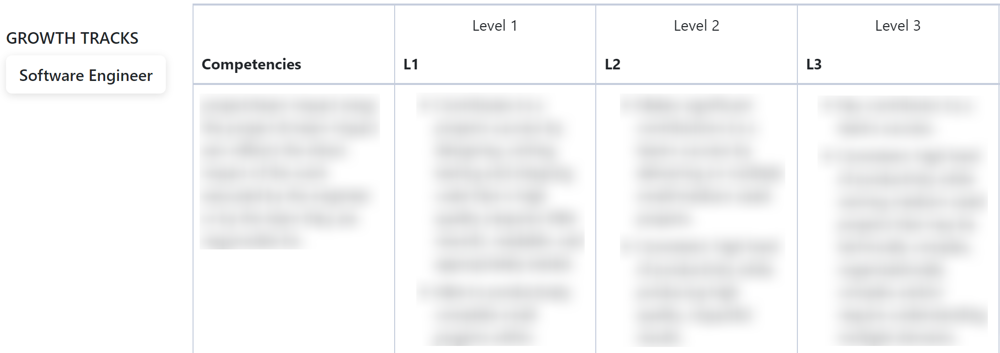

=== Feedback Forms ===
Contributors: Garima Rajput
Tags: communication, feedback, career growth, meetings, growth tracker
Requires at least: 4.9
Tested up to: 1.0
Stable tag: 1.0.0
License: GPL-3.0-or-later
License URI: http://www.gnu.org/licenses/gpl-3.0.html

Enhance communication and foster professional growth with Feedback Forms. This plugin enables employees to give and receive feedback, track career growth, and schedule one-on-one meetings.
Additionally, WordPress Administrators can add growth tracks for various positions such as software engineer, manager, quality analyst, SEO specialist, and more. Employees can track their progress within these growth tracks, set goals, and identify areas for improvement.

== Description ==

Feedback Forms is a powerful WordPress plugin designed to enhance communication and foster professional growth within organizations. It provides the following features:

- Feedback Exchange: Employees with the "employee" user role can easily give and receive feedback from colleagues.
- Request Feedback: Users can request feedback from specific colleagues for targeted input.
- Career Growth Tracking: Employees can track their professional development, set goals, and monitor progress over time.
- One-on-One Meetings: Schedule and manage one-on-one meetings with managers or colleagues.

== Installation ==

1. Log in to your WordPress admin dashboard.
2. Feedback Forms can be installed directly through your WordPress Plugins dashboard.
3. Go to "Plugins" > "Add New".
4. Search for “Feedback Forms” and Choose the Feedback Forms Plugin and click "Install Now". 
5. Once the installation is complete, click on "Activate" to activate the Feedback Forms plugin.

== Frequently Asked Questions ==

**Q: How can employees give and receive feedback?**
A: Employees with the "employee" user role can use Feedback Forms to easily exchange feedback with their colleagues.

**Q: Can I track my career growth using this plugin?**
A: Yes, Feedback Forms provides a career growth tracking system where employees can monitor their progress, set goals, and identify areas for improvement.

**Q: Can I schedule one-on-one meetings with managers or colleagues?**
A: Absolutely! Feedback Forms allows you to schedule and manage one-on-one meetings, facilitating effective communication and mentorship within the organization.

**Q: How can employees track their career growth?**
A: Feedback Forms offers a career growth tracking system for employees to log achievements, set goals, and monitor progress. Gain insights, identify strengths, improve weaknesses, and advance your career within the organization.

**Q: Can I customize growth tracks for different positions?**
A: Absolutely! As a WordPress Administrator, you have the flexibility to add growth tracks for various positions within your organization. You can tailor the growth track to suit the specific requirements and career advancement of each position.

**Q: Is Feedback Forms suitable for organizations of all sizes?**
A: Yes! Feedback Forms is designed to benefit organizations from small businesses to large enterprises. It provides a scalable solution to enhance communication, collaboration, and professional development within the workplace, irrespective of the organization's size or industry.

== Screenshots ==

1. 
2. 
3. 
4. 

== Changelog ==

= 1.0.0 =
* Initial release

== Upgrade Notice ==

= 1.0.0 =
This is the initial release of the Feedback Forms plugin.

== Support ==

If you encounter any issues or have questions regarding the Feedback Forms plugin, please visit our support page at [Feedback-Forms-Support](https://wordpress.org/support/plugin/feedback-forms/).

<!-- == Contributing ==

We welcome contributions to enhance the Feedback Forms plugin. If you'd like to contribute, please follow our contribution guidelines available on our GitHub repository at [github.com/yourusername/feedback-forms](https://github.com/yourusername/feedback-forms). -->

